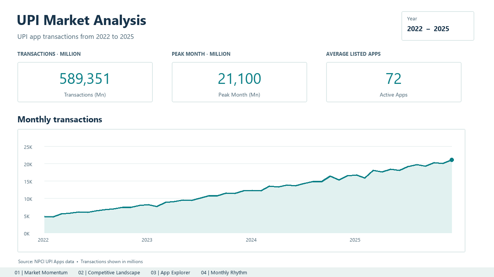

# UPI Market Analysis

**Python · Power BI · optional MySQL**

This project looks at how India's UPI app market changed from January 2022 to December 2025. Python prepares the monthly app data published by [NPCI](https://www.npci.org.in/what-we-do/upi/upi-ecosystem-statistics), and Power BI brings the results together in an interactive report. The downloadable Power BI project includes a snapshot of the prepared data, so its visuals can load without a local MySQL database.

## View the dashboard

This preview uses the same prepared data and layout as the **Market Momentum** page. For the exact interactive Power BI rendering, download the [Power BI project ZIP](powerbi/UPI%20Market%20Analysis%20-%20Power%20BI%20project.zip), extract it, open `UPI Market Analysis.pbip` in Power BI Desktop, and select **Refresh**. The project has four report tabs: Market Momentum, Competitive Landscape, App Explorer, and Monthly Rhythm. No MySQL sign-in is needed for this downloadable version.

## In the report

- **Market Momentum** tracks monthly transaction volume.
- **Competitive Landscape** compares the leading apps and their market shares.
- **App Explorer** lets you filter by app and year.
- **Monthly Rhythm** shows how volume varies across the calendar year.

The report has year and app filters, and charts on the same page respond to selections.

## Data notes

The dataset covers 48 monthly NPCI **UPI Apps** workbooks. Monthly volume is the sum of the apps listed in each workbook, which can differ from NPCI's separate network-wide UPI total. App shares use that monthly app sum as the denominator.

The preparation step combines duplicate app rows and standardizes a few name variants. A dash in the source is read as zero; an unreadable value cell stays missing. The original NPCI workbooks are not included here.

## Files

| File | What it does |
| --- | --- |
| [Complete project download](UPI%20Market%20Analysis%20-%20Source.zip) | All project files in one ZIP |
| [`build.py`](build.py) | Prepares six CSV tables from the monthly workbooks |
| [`load_mysql.py`](load_mysql.py) and [`schema.sql`](schema.sql) | Loads five analysis tables into MySQL |
| [`analysis.sql`](analysis.sql) | Queries for volume, app share, and trends |
| [`build_powerbi.py`](build_powerbi.py) | Creates a portable Power BI project with embedded data; `--source mysql` uses MySQL instead |
| [`data/processed/`](data/processed/) | Prepared CSV data |
| [`test_project.py`](test_project.py) | Checks the prepared data |

## Getting started

1. Install Power BI Desktop, download the Power BI project ZIP above, extract it, open `UPI Market Analysis.pbip`, and select **Refresh**.
2. To rebuild the data, install Python 3.10+ and the packages in `requirements.txt`. Download the monthly UPI Apps workbooks from [NPCI](https://www.npci.org.in/what-we-do/upi/upi-ecosystem-statistics) into `data/raw/`. Keep filenames ending in `YYYY-Mon.xlsx`, then run `python build.py --source data/raw` and `python build_powerbi.py`.
3. If you specifically want MySQL, install MySQL Server 8.0+ and [MySQL Connector/NET](https://learn.microsoft.com/en-us/power-query/connectors/mysql-database#prerequisites). Load the included CSVs with `python load_mysql.py --host localhost --port 3306 --database upi_market_analysis --user root`, then run `python build_powerbi.py --source mysql`. Power BI will ask for Database authentication during refresh.
4. Run `python -m unittest -v test_project.py` to check the prepared data.

Keep MySQL passwords out of the project files. The optional MySQL loader reads a password from the environment or a hidden prompt; Power BI Desktop stores its connection credentials separately.

## Source and license

Project owner: **Rakesh**. The code and report files are covered by the [MIT license](LICENSE). The underlying UPI statistics come from [NPCI](https://www.npci.org.in/what-we-do/upi/upi-ecosystem-statistics).

The Power BI project files were generated and checked for structure. The preview above is generated from the included data; final visual rendering still needs a refresh and review in Power BI Desktop.
